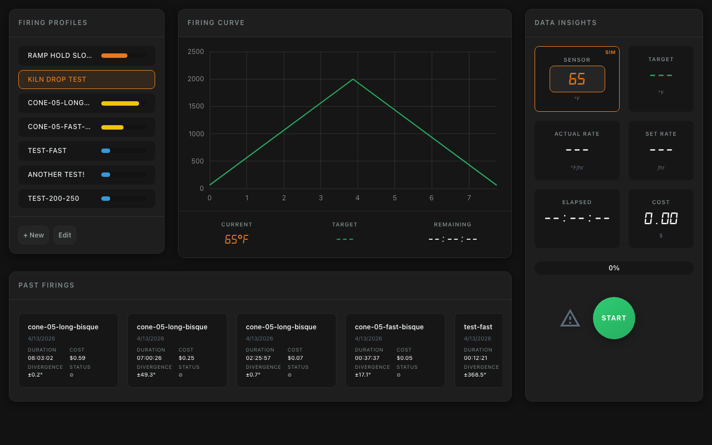
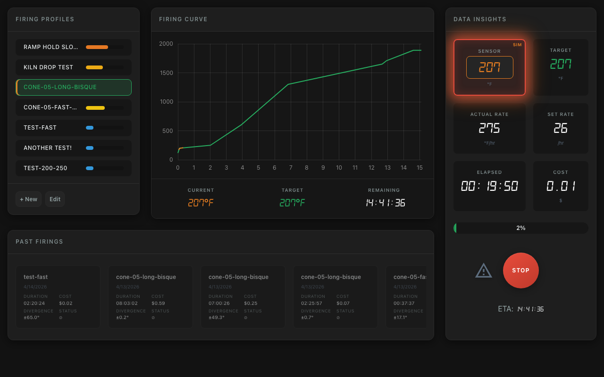
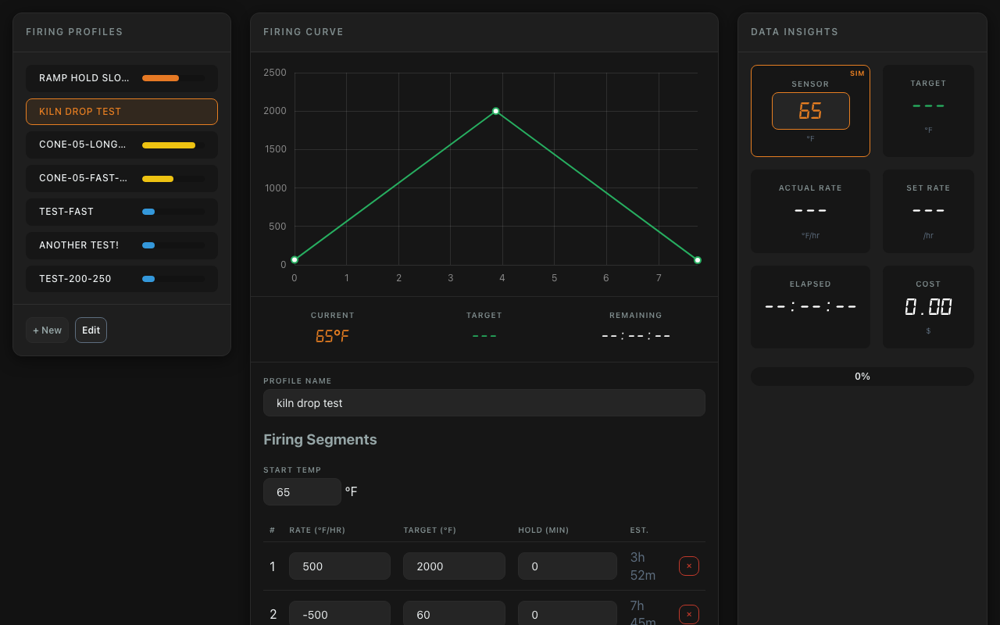
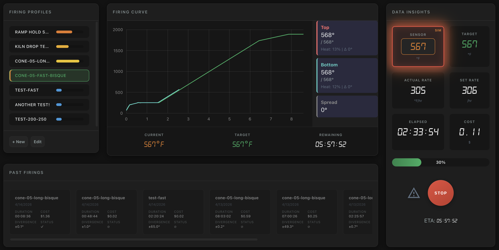

Kiln Controller
==========

Turns a Raspberry Pi into an inexpensive, web-enabled kiln controller.

**Dashboard**

**Run Kiln Schedule**

**Edit Kiln Schedule**

## Major Changes from jbruce's Original Repository

### Rate-Based Firing Profiles

Replaced the legacy time-temperature point format with an intuitive segment-based system. Define firing schedules the way ceramicists think: heating rate in degrees per hour, target temperature, and hold time. Supports special rates like `"max"` (full power) and `"cool"` (natural cooling). Legacy v1 profiles auto-convert on load.

See [Rate-Based Profiles Documentation](docs/profiles-v2.md) for format details, examples, and migration instructions.

### Multi-Zone PID Control

Independent PID control for kilns with multiple heating zones. Each zone gets its own thermocouple, SSR output, and individually tuned PID parameters. A configurable control strategy (`coldest`, `hottest`, `average`, or a specific zone index) determines which zone drives schedule progression. Per-zone safety monitoring detects stalled elements and stuck relays independently.

See [Multi-Zone Documentation](docs/multi-zone.md) for configuration, hardware setup, and control strategies.

### MQTT Integration

Publish real-time kiln state to an MQTT broker for remote monitoring, Home Assistant integration, or AI agent orchestration. Topics include per-zone temperatures, heat duty cycles, firing state, and zone spread metrics. Supports remote pause/resume/stop commands. Change-only publishing reduces broker traffic by ~70% during stable operation.

See [MQTT Documentation](docs/mqtt.md) for topic structure, commands, and integration examples.

### Firing Logs with Divergence Tracking

Every firing is automatically logged with full temperature history, cost, duration, and average temperature divergence from the target profile. Past firings appear in a scrollable gallery on the dashboard. Pin important firings for quick reference. View historical firing curves overlaid on the original target profile.

See [Firing Logs Documentation](docs/firing-logs.md) for data format, API endpoints, and features.

### Redesigned Interface

Complete UI overhaul with a dark industrial theme, three-panel dashboard layout, and 5 responsive breakpoints for mobile through desktop. Features include LED-style temperature displays with heat glow effects, real-time data insights (actual rate, set rate, elapsed time, cost, ETA), interactive graph crosshair with touch support, and a past firings gallery. Touch targets are 44px+ for reliable mobile use.

### Additional Improvements

  * **Cooldown time calculation** - Estimates time to 100F based on Newton's law of cooling using recent cooling rate
  * **Fixed cost calculation** - Corrected 50% underreporting in cost tracking
  * **Critical bug fixes** - Fixed 8 critical/high-priority bugs including schedule completion crashes, temperature conversion errors, PID integral windup, and file locking issues

## Features

  * supports [many boards](docs/supported-boards.md) in addition to Raspberry Pi
  * supports Adafruit MAX31856 and MAX31855 thermocouple boards
  * support for K, J, N, R, S, T, E, or B type thermocouples
  * easy to create new kiln schedules and edit / modify existing schedules
  * no limit to runtime - fire for days if you want
  * view status from multiple devices at once - computer, tablet, phone
  * real-time firing cost estimate
  * real-time heating rate displayed in degrees per hour
  * supports PID parameters you tune to your kiln
  * monitors temperature in kiln after schedule has ended
  * API for starting and stopping at any point in a schedule
  * accurate simulation with configurable speedup factor
  * support for shifting schedule when kiln cannot heat quickly enough
  * support for skipping first part of profile to match current kiln temperature
  * prevents integral wind-up when temperatures not near the set point
  * automatic restarts if there is a power outage or other event
  * support for a watcher to page you via Slack if your kiln is out of whack
  * easy scheduling of future kiln runs

## Hardware

### Parts

| Image | Hardware | Description |
| ------| -------- | ----------- |
|  | [Raspberry Pi](https://www.adafruit.com/category/105) | Virtually any Raspberry Pi will work since only a few GPIO pins are being used. Any board supported by [blinka](https://circuitpython.org/blinka) and has SPI should work. You'll also want to make sure the board has wifi. If you use something other than a Raspberry PI and get it to work, let me know. |
|  | [Adafruit MAX31855](https://www.adafruit.com/product/269) or [Adafruit MAX31856](https://www.adafruit.com/product/3263) | Thermocouple breakout board |
|  | [Thermocouple](https://www.auberins.com/index.php?main_page=product_info&cPath=20_3&products_id=39) | Invest in a heavy duty, ceramic thermocouple designed for kilns. Make sure the type will work with your thermocouple board. Adafruit-MAX31855 works only with K-type. Adafruit-MAX31856 is flexible and works with many types, but folks usually pick S-type. |
|  | Breadboard | breadboard, ribbon cable, connector for pi's gpio pins & connecting wires |
|  | Solid State Relay | Zero crossing, make sure it can handle the max current of your kiln. Even if the kiln is 220V you can buy a single [3 Phase SSR](https://www.auberins.com/index.php?main_page=product_info&cPath=2_30&products_id=331). It's like having 3 SSRs in one. Relays this big always require a heat sink. For multi-zone kilns, you need one SSR per zone. |
|  | Electric Kiln | There are many old electric kilns on the market that don't have digital controls. You can pick one up on the used market cheaply. This controller will work with 110V or 220V (pick a proper SSR). My kiln is a Skutt KS-1018. |

### Schematic

The pi has three gpio pins connected to the MAX31855 chip. D0 is configured as an input and CS and CLK are outputs. The signal that controls the solid state relay starts as a gpio output which drives a transistor acting as a switch in front of it. This transistor provides 5V and plenty of current to control the ssr. Since only four gpio pins are in use, any pi can be used for this project. See the [config](config.py) file for gpio pin configuration.

My controller plugs into the wall, and the kiln plugs into the controller. 

**WARNING** This project involves high voltages and high currents. Please make sure that anything you build conforms to local electrical codes and aligns with industry best practices.

**Note:** The GPIO configuration in this schematic does not match the defaults, check [config](config.py) and make sure the gpio pin configuration aligns with your actual connections.

*Note: I tried to power my ssr directly using a gpio pin, but it did not work. My ssr required 25ma to switch and rpi's gpio could only provide 16ma. YMMV.*

## Software 

### Raspberry PI OS

Download [Raspberry PI OS](https://www.raspberrypi.org/software/). Use Rasberry PI Imaging tool to install the OS on an SD card. Boot the OS, open a terminal and...

    $ sudo apt-get update
    $ sudo apt-get dist-upgrade
    $ git clone https://github.com/omegalens/kiln-controller
    $ cd kiln-controller
    $ python3 -m venv venv
    $ source venv/bin/activate
    $ pip install -r requirements.txt

*Note: The above steps work on ubuntu if you prefer*

### Raspberry PI deployment

If you're done playing around with simulations and want to deploy the code on a Raspberry PI to control a kiln, you'll need to do this in addition to the stuff listed above:

    $ sudo raspi-config
    interfacing options -> SPI -> Select Yes to enable
    select reboot

## Configuration

All parameters are defined in config.py. You need to read through config.py carefully to understand each setting. Here are some of the most important settings:

| Variable | Default | Description |
| -------- | ------- | ----------- |
| sensor_time_wait | 2 seconds | It's the duty cycle for the entire system. It's set to two seconds by default which means that a decision is made every 2s about whether to turn on relay[s] and for how long. If you use mechanical relays, you may want to increase this. At 2s, my SSR switches 11,000 times in 13 hours. |
| temp_scale | f | f for farenheit, c for celcius |
| pid parameters | | Used to tune your kiln. See PID Tuning. |
| simulate | True | Simulate a kiln. Used to test the software by new users so they can check out the features. |
| zones | [] | Multi-zone configuration. See [Multi-Zone Documentation](docs/multi-zone.md). |
| mqtt_enabled | False | Enable MQTT publishing. See [MQTT Documentation](docs/mqtt.md). |
| use_rate_based_control | True | Use rate-based segment control (v2 profiles). See [Profiles Documentation](docs/profiles-v2.md). |

## Testing

After you've completed connecting all the hardware together, there are scripts to test the thermocouple and to test the output to the solid state relay. Read the scripts below and then start your testing. First, activate the virtual environment like so...

     $ source venv/bin/activate

then test the thermocouple with:

     $ ./test-thermocouple.py

then test the output with:

     $ ./test-output.py

and you can use this script to examine each pin's state including input/output/voltage on your board:

     $ ./gpioreadall.py

## PID Tuning

Run the [autotuner](docs/ziegler_tuning.md). It will heat your kiln to 400F, pass that, and then once it cools back down to 400F, it will calculate PID values which you must copy into config.py. No tuning is perfect across a wide temperature range. Here is a [PID Tuning Guide](docs/pid_tuning.md) if you end up having to manually tune.

There is a state view that can help with tuning. It shows the P,I, and D parameters over time plus allows for a csv dump of data collected. It also shows lots of other details that might help with troubleshooting issues. Go to /state.

## Usage

### Server Startup

    $ source venv/bin/activate; ./kiln-controller.py

### Autostart Server onBoot
If you want the server to autostart on boot, run the following command:

    $ /home/user/kiln-controller/start-on-boot

### Client Access

Click http://127.0.0.1:8081 for local development or the IP
of your PI and the port defined in config.py (default 8081).

### Simulation

In config.py, set **simulate=True**. Start the server and select a profile and click Start. Simulations run at near real time. Set `sim_speedup_factor` to 50 or 100 for fast testing.

### Scheduling a Kiln run

If you want to schedule a kiln run to start in the future. Here are [examples](docs/schedule.md).

### Watcher

If you're busy and do not want to sit around watching the web interface for problems, there is a watcher.py script which you can run on any machine in your local network or even on the raspberry pi which will watch the kiln-controller process to make sure it is running a schedule, and staying within a pre-defined temperature range. When things go bad, it sends messages to a slack channel you define. I have alerts set on my android phone for that specific slack channel. Here are detailed [instructions](docs/watcher.md).

## Documentation

| Document | Description |
| -------- | ----------- |
| [Rate-Based Profiles](docs/profiles-v2.md) | V2 profile format, segment types, migration from v1 |
| [Multi-Zone Control](docs/multi-zone.md) | Multi-zone configuration, control strategies, safety |
| [MQTT Integration](docs/mqtt.md) | Topic structure, commands, Home Assistant examples |
| [Firing Logs](docs/firing-logs.md) | Firing history, divergence tracking, API endpoints |
| [API Reference](docs/api.md) | REST API and WebSocket endpoints |
| [PID Tuning](docs/pid_tuning.md) | Manual PID tuning guide |
| [Ziegler-Nichols Autotuner](docs/ziegler_tuning.md) | Automatic PID tuning |
| [Watcher](docs/watcher.md) | Slack alerting for unattended firings |
| [Scheduling](docs/schedule.md) | Schedule future kiln runs |
| [Troubleshooting](docs/troubleshooting.md) | Hardware debugging guide |

## License

This program is free software: you can redistribute it and/or modify
it under the terms of the GNU General Public License as published by
the Free Software Foundation, either version 3 of the License, or
(at your option) any later version.

This program is distributed in the hope that it will be useful,
but WITHOUT ANY WARRANTY; without even the implied warranty of
MERCHANTABILITY or FITNESS FOR A PARTICULAR PURPOSE.  See the
GNU General Public License for more details.

You should have received a copy of the GNU General Public License
along with this program.  If not, see <http://www.gnu.org/licenses/>.

## Support & Contact

Please use the issue tracker for project related issues.
If you're having trouble with hardware, I did too. Here is a [troubleshooting guide](docs/troubleshooting.md) I created for testing RPi gpio pins.

## Origin
This project was originally forked from https://github.com/apollo-ng/picoReflow but has diverged a large amount.
